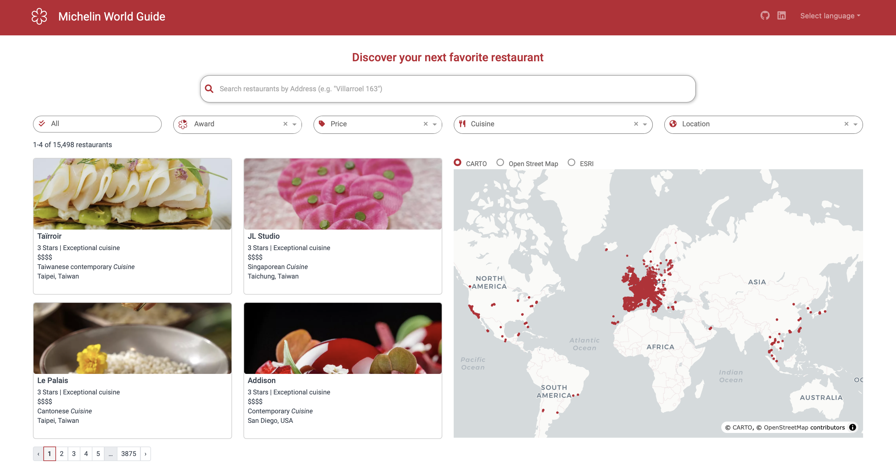

 

  

  <h3 align="center">Michelin World Guide App</h3>

  

    The Michelin World Guide app is your ultimate culinary companion, bringing the world’s top restaurants to your fingertips. 
    With stunning photos, it allows you to “feast with your eyes”, making it easy to explore renowned dining spots wherever 
    your travels take you.
     
     
    <strong>Part of the Plotly Dash
    <a href="https://community.plotly.com/t/autumn-app-challenge/87373" target="_blank" style="color: #bd2333;">Autumn App Challenge 2024 »</a>
     
     
    <strong>The app can be accessed
    <a href="https://challengemichelin-122629525979.southamerica-east1.run.app" target="_blank" style="color: #bd2333;"">here »</a>
    </strong>
  

---

### Key Features

* **Design and Responsiveness:** CSS makes up 10% of the code, reflecting a significant 
investment in the app’s design and responsiveness.  

* **Advanced Search:** The app includes a Search bar where users can look up restaurants 
by address. The search functionality is enhanced by using SentenceTransformer's 
multi-qa-mpnet-base-dot-v1 model.  

* **Enhanced Dataset:** The dataset has been enriched with restaurant photos obtained 
through web scraping, offering a more visual experience.  

* **Multi-language Support:** The app supports both English and Portuguese, with language 
selection available via a dropdown menu.  

* **Map Options:** Users can switch between three different map types—OpenStreetMap, 
ESRI, and CARTO—providing flexibility in viewing preferences.

---

### Overview

---

### Built With

This project has been built using Python, Plotly Dash framework and CSS.

---

### Contact

For feedback and notes, please reach out to <a href="https://www.linkedin.com/in/mayaradaher" target="_blank" style="color: #bd2333;">Mayara Daher</a>
